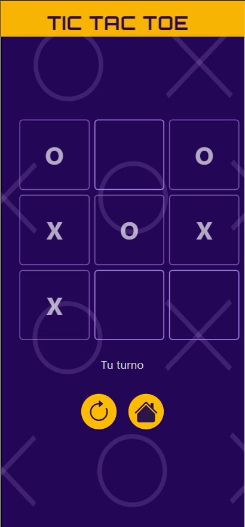

# 🕹️ Tic Tac Toe - Juego Web

Este proyecto es una implementación web del clásico juego **Tic Tac Toe**, con un backend en **FastAPI** y un frontend desarrollado en **HTML/CSS/JavaScript**. El juego permite jugar contra una inteligencia artificial  con tres niveles de dificultad.


## 🎯 Características

- Juego responsive y visualmente atractívo.
- Tres niveles de dificultad
  - **Fácil**: Movimientos completamenta aleatorios.
  - **Normal**: Bloquea victorias del jugador o gana si puede; si no, juega aleatoriamente.
  - **Difícil**: Utiliza el algoritmo **Minimax** para tomar decisiones óptimas.
- Lógica modular en frontend y backend.
- API RESTful para procesar y responder jugadas.
- Arquitectura limpia y escalable

## Captura de Pantalla

**Versión Móvil**



**Versión de Escritorio**


## 📁 Estructura del Proyecto

```markdown
.
├── backend/
│ ├── api/
│ │ └── routes.py
│ ├── core/
│ │ └── config.py
│ ├── models/
│ │ └── schemas.py
│ ├── services/
│ │ └── game_logic.py
│ └── main.py
├── frontend/
│ ├── css/
│ │ └── styles.css
│ ├── images/
│ │ └── background.svg
│ ├── js/
│ │ └── api.js
│ │ └── config.js
│ │ └── dom.js
│ │ └── game.js
│ └── index.html
└── requirements.txt
```

## 🚀 Instalación y Ejecución

### 1. Clonar el repositorio

```bash
git clone https://github.com/IsaiasRVH2/tic-tac-toe-web
cd tic-tac-toe
```

### 2. Configurar y lanzar el backend

```bash
python -m venv venv
source venv/bin/activate # o venv\Scripts\activate en Windows
pip install -r requirements.txt
uvicorn backend.main:app --reload
```
El backend correrá por defecto en `http://127.0.0.1:8000`.

### 3. Abrir el frontend

Puedes abrir el  `frontend/index.html` directamente en el navegador, o usar un servidor estático local:
```bash
cd frontend
python -m http.server
```
Luego abrir `http://localhost:8000` en el navegador.

## 🧠 Algoritmos de Decisión

- **Fácil**: Movimientos aleatorios.
- **Normal**: Movimientos defensivos o ofensivos simples.
- **Difícil**: Algoritmo **Minimax** que evalúa todos los estados posibles para encontrar la jugada óptima.

## 🔧 Configuración

El archivo `backend/core/config.py` permite definir los origenes permitidos en el backend mediante la variable de entorno `ALLOWED_ORIGINS`. Adémas se definen las variables `APP_ENV` y `DEBUG_MODE`.

## 📦 Requisitos

- Python 3.9+
- FastAPI
- Uvicorn
- Bootstrap 5 (CDN agregado en frontend)